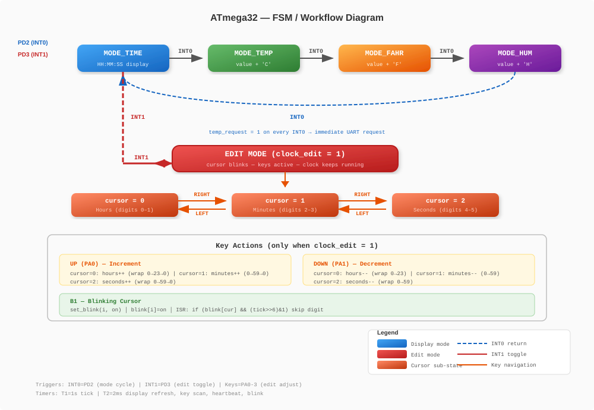
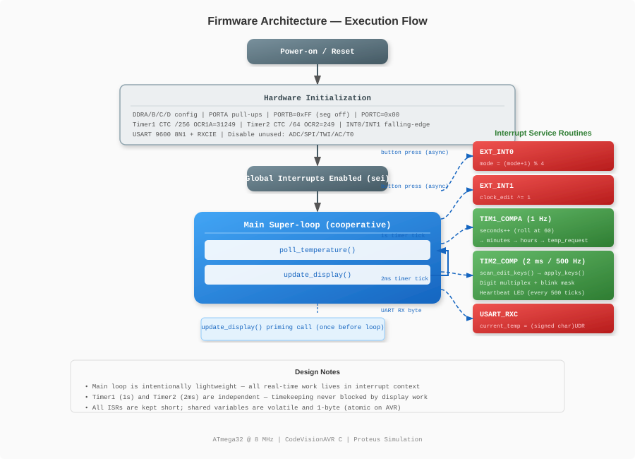
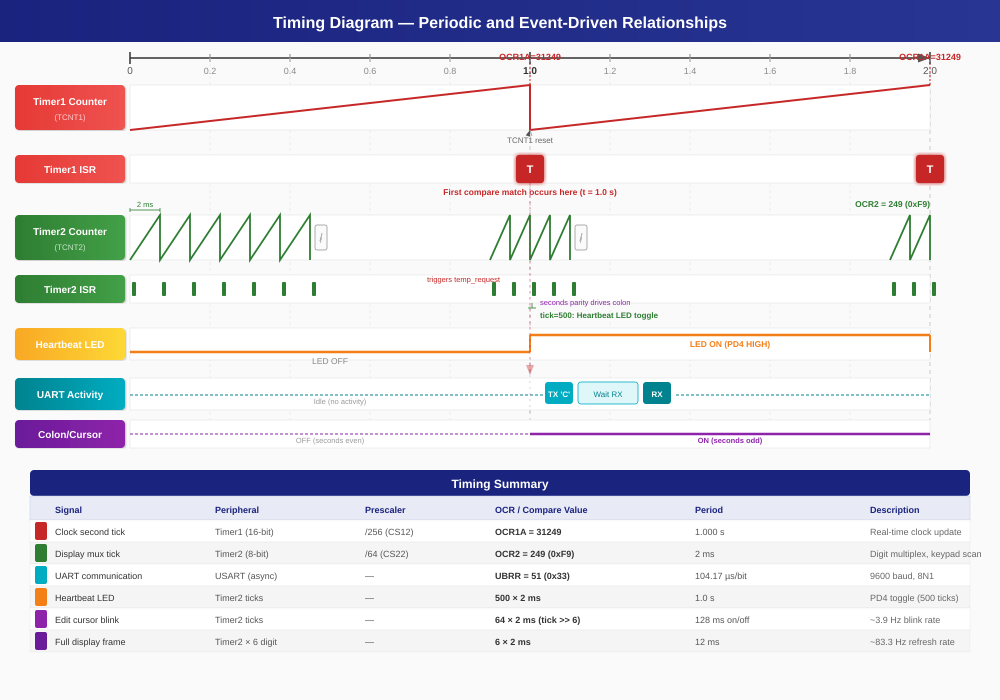
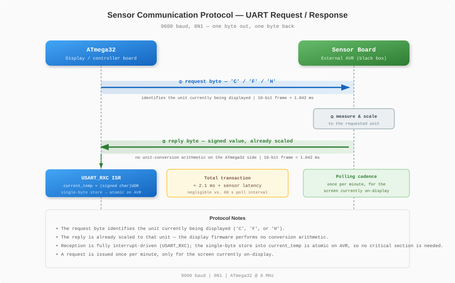
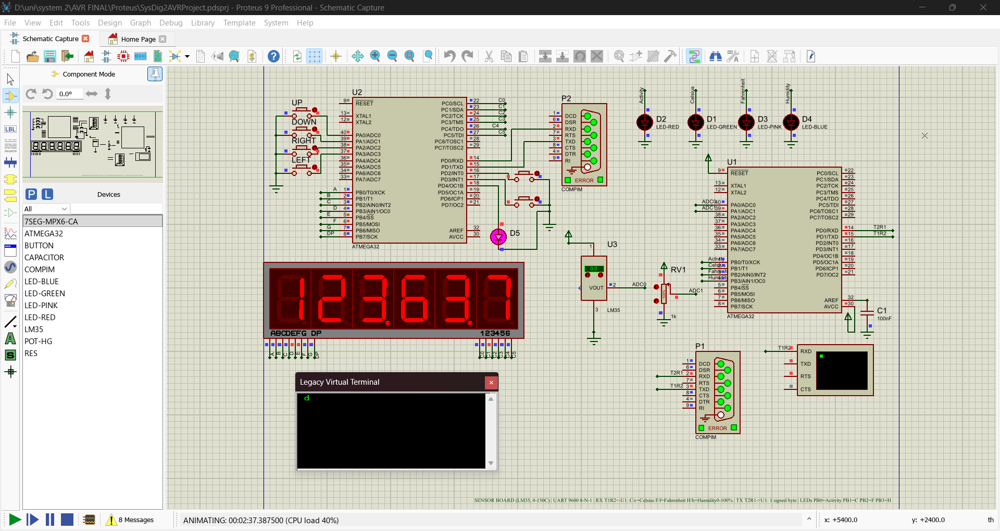
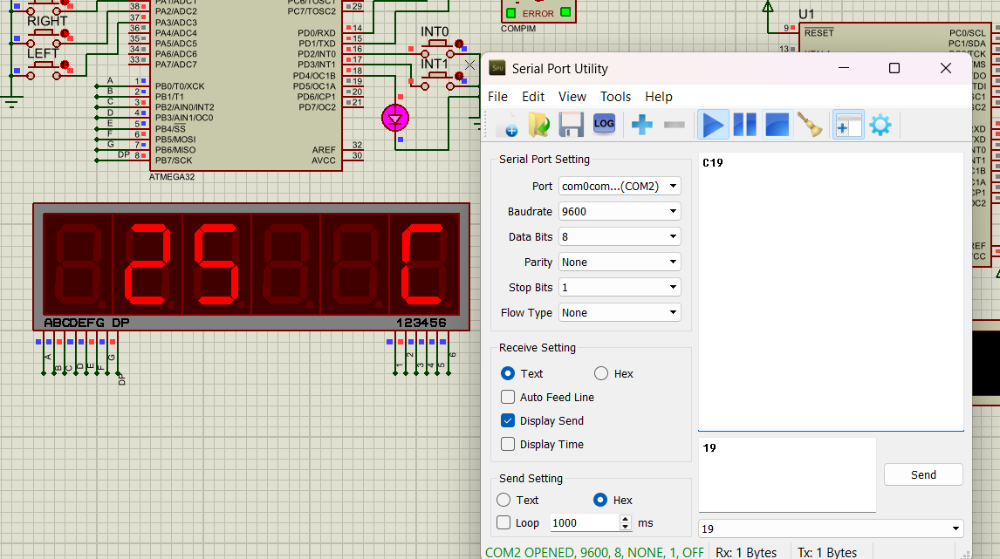
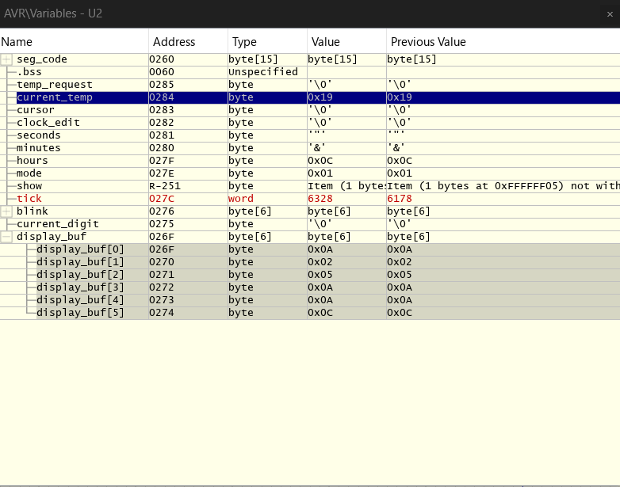

# Multiplexed 7-Segment Clock & Environmental Monitoring System (ATmega32)

A bare-metal embedded C firmware for the **Atmel ATmega32** that turns a single 6-digit common-anode seven-segment display into four time-multiplexed screens — a 24-hour clock and three live environmental readings — driven entirely by two hardware timers and a lightweight interrupt architecture.

> Built and simulated with **CodeVisionAVR** + **Proteus Design Suite**.

---

## Table of Contents

- [Overview](#overview)
- [Why This Project](#why-this-project)
- [Features](#features)
- [System Architecture](#system-architecture)
- [Multiplexing: The Core Idea](#multiplexing-the-core-idea)
- [Firmware Workflow](#firmware-workflow)
- [Timing Design](#timing-design)
- [Sensor Communication Protocol](#sensor-communication-protocol)
- [Simulation & Results](#simulation--results)
- [Repository Structure](#repository-structure)
- [Documentation](#documentation)
- [Conclusion & Future Work](#conclusion--future-work)

---

## Overview

This repository implements an embedded instrument that combines a **real-time clock** with **remote environmental monitoring** on a single ATmega32 microcontroller (8 MHz).

The same 6 physical digits are reused, via time-division multiplexing, to present four logical screens:

| Screen  | Content                                  |
|---------|-------------------------------------------|
| `TIME`  | 24-hour clock, `HH:MM:SS`, blinking colons |
| `TEMP`  | Ambient temperature in °C                  |
| `FAHR`  | Ambient temperature in °F                  |
| `HUM`   | Relative humidity in %                     |

Environmental data is **not** measured on this board — it is requested on demand from a separate sensor microcontroller over a simple UART request/response protocol, keeping the display firmware free of any analog measurement or unit-conversion logic.

## Why This Project

Driving more than 2–3 seven-segment digits directly would require far too many I/O pins on an 8-bit microcontroller (8 pins × 6 digits = 48 pins). This project demonstrates a compact, interrupt-driven solution to that constraint while also exploring several classic embedded-systems problems in one firmware:

- Precise timekeeping independent of a busy display refresh loop
- Deterministic multiplexing without visible flicker or ghosting
- Debounced keypad input for interactive editing
- A visual "edit cursor" that blinks a *specific pair of digits* without disturbing the rest of the display
- A minimal, unit-agnostic protocol for talking to an external sensor board

## Features

- 6-digit multiplexed 7-segment display, ~83 Hz frame refresh
- 24-hour software clock (`HH:MM:SS`) with per-second blinking colons
- Screen cycling via external interrupt (`INT0`): `TIME → TEMP → FAHR → HUM → TIME`
- Clock **edit mode** via external interrupt (`INT1`):
  - 4-key keypad: `LEFT` / `RIGHT` move the cursor between hours, minutes, seconds
  - `UP` / `DOWN` increment/decrement the selected field with wrap-around
  - The active field's digit pair blinks at ~2 Hz while the clock keeps running in the background
- UART-based sensor polling (9600 baud, 8N1) once per minute, only for the active screen
- Signed value formatting (minus sign) for temperature, unsigned for humidity
- Software keypad debouncing sampled at the 2 ms multiplexing rate
- 1 Hz heartbeat LED for a visual "firmware alive" indicator
- Fully interrupt-driven: five ISRs, minimal, non-blocking main loop

## System Architecture

The system is split into two cooperating subsystems:

1. **Display/controller board** (this repository) — ATmega32 + display + keypad + buttons + LED
2. **Remote sensor board** — a separate AVR (treated as a black box) that performs the analog measurements and answers UART requests with pre-scaled byte values


*Figure: ATmega32 controller board — Port A (keypad), Port B (segment lines), Port C (digit enables), and Port D (UART, INT0/INT1 buttons, heartbeat LED) — communicating with the remote sensor board over a 9600 baud UART link.*

Full pin mapping and component list: **[docs/hardware.md](docs/hardware.md)**

### Screen & Edit-Mode State Machine


*Figure: The four display screens cycled by INT0 (`TIME → TEMP → FAHR → HUM`), with INT1 toggling edit mode and the keypad driving cursor navigation and field adjustment within it.*

### Firmware Architecture


*Figure: The non-blocking main loop (temperature polling + display update) alongside the five interrupt service routines that handle all time-critical work — screen switching, edit toggling, timekeeping, multiplexing, and UART reception.*

## Multiplexing: The Core Idea

In a common-anode display, a digit is enabled by driving its anode line HIGH, and a segment lights when its cathode is pulled LOW. Instead of wiring all 48 segment/digit combinations independently, all six digits share the same 8 segment lines (Port B), and only **one digit's anode is enabled at a time** (Port C, one-hot).

The firmware cycles through the six digits at a fixed 2 ms interval, driven by Timer2:

1. Turn off all digits (`PORTC = 0x00`) — prevents ghosting during the segment-data transition.
2. Load the segment pattern for the *next* digit onto `PORTB`.
3. Conditionally light the colon decimal points (TIME mode only).
4. Enable that digit's anode via `PORTC`.
5. Advance the digit counter (mod 6).

| Parameter | Value |
|---|---|
| Digit ON time | 2 ms |
| Full frame (6 digits) | 12 ms |
| Refresh rate | ≈ 83.3 Hz (well above flicker-fusion threshold) |

Because the human eye cannot resolve individual digit flashes above ~60 Hz, all six digits appear continuously and simultaneously lit.

## Firmware Workflow

The firmware keeps the main loop deliberately "dumb" and pushes all time-critical work into interrupts:

```
main()
 ├─ Initialize ports, pull-ups, Timer1, Timer2, INT0/INT1, USART
 ├─ Disable unused peripherals (ADC, comparator, SPI, TWI, Timer0)
 ├─ Enable global interrupts
 └─ loop forever:
      ├─ poll_temperature()   → sends one UART request per minute
      └─ update_display()     → rebuilds display_buf[] for the active screen
                                  and recomputes the edit-cursor blink mask
```

A **double-buffered display** decouples the main loop from the display refresh:

- The main loop writes glyph indices into `display_buf[6]` via `update_display()`.
- The Timer2 ISR reads `display_buf[6]` one digit at a time, every 2 ms, and drives the physical outputs.

This means `update_display()` can take a variable amount of time (branching per screen mode) without ever affecting the precision of the multiplexing refresh.

### Interrupt Map

| Priority | Source | Responsibility |
|---|---|---|
| 1 | `INT0` | Cycle active screen (`TIME → TEMP → FAHR → HUM`) |
| 2 | `INT1` | Toggle clock edit mode |
| 3 | `TIM1_COMPA` | One-second timekeeping (seconds/minutes/hours) |
| 4 | `TIM2_COMP` | 2 ms tick: keypad scan, multiplexing, blink, heartbeat |
| 5 | `USART_RXC` | Store incoming sensor reply byte |

Deep-dive into each ISR, the glyph/blink mechanism, and full code listings: **[docs/implementation.md](docs/implementation.md)**

## Timing Design


*Figure: Timer1's 1 Hz compare-match tick driving the clock, alongside Timer2's 2 ms cadence that drives multiplexing, keypad scanning, edit-cursor blink, and the heartbeat LED.*

Two hardware timers, both in CTC (Clear-Timer-on-Compare-Match) mode, anchor every time-based behavior in the system:

| Timer | Mode | Prescaler | Compare value | Resulting rate | Purpose |
|---|---|---|---|---|---|
| Timer1 (16-bit) | CTC | /256 | 31250 | **1 Hz** | Clock tick (seconds/minutes/hours) |
| Timer2 (8-bit) | CTC | /64 | 250 | **500 Hz** (2 ms) | Multiplexing, keypad scan, blink, heartbeat |

Derived timing behavior:

- **Edit-cursor blink:** toggles every 64 Timer2 ticks (128 ms) → ≈ 3.9 Hz toggle, ≈ 2 Hz perceived blink
- **Heartbeat LED:** toggles every 500 Timer2 ticks → exactly 1 s
- **Keypad debounce:** sampled every 2 ms; falling-edge detection (`(prev ^ curr) & prev`) rejects bounce trains that resolve within a single press

Full derivations and the timing diagram: **[docs/implementation.md](docs/implementation.md#timing-analysis)**

## Sensor Communication Protocol

The display board and sensor board exchange exactly one byte in each direction, at 9600 baud / 8N1:


*Figure: Request/response exchange between the ATmega32 and the sensor board — one request byte out, one pre-scaled reply byte back, followed by an atomic, interrupt-driven store into `current_temp`.*

- The request byte identifies the unit currently being displayed.
- The reply is **already scaled** to that unit — the display firmware performs no conversion arithmetic.
- Reception is fully interrupt-driven (`USART_RXC`); because the reply is a single byte, storing it into `current_temp` is atomic on the AVR and needs no critical section.
- A request is issued once per minute, only for the screen currently on-display.

## Simulation & Results

The design was verified in **Proteus Design Suite**, with `final.hex` (this firmware) loaded on the display-controller ATmega32 and a companion sensor image loaded on a second AVR.

### Functional Behavior


*Figure: Full simulation setup — the ATmega32 multiplexing the 6-digit display, with the keypad and control buttons wired on the same board.*

Confirmed behavior:

- Power-up shows `12:34:00` on the `TIME` screen; seconds increment at exactly 1 Hz, and both colons blink in step with the seconds parity.
- `INT0` correctly cycles `TIME → TEMP → FAHR → HUM → TIME`; each sensor screen shows its unit letter (`C`/`F`/`H`) in the last digit, the value right-justified in digits 0–2, and a separator glyph in digit 4 for temperature screens.
- `INT1` enters edit mode from the `TIME` screen; `LEFT`/`RIGHT` move the cursor across hours/minutes/seconds, and the selected field's digit pair blinks at ≈2 Hz while the clock continues to run.
- `UP`/`DOWN` adjust the selected field with correct wrap-around (24 for hours, 60 for minutes/seconds).
- The heartbeat LED toggles once per second throughout.

### UART Injection Tests

To validate the receive path and display formatting independently of the sensor board's actual measurements, single bytes were injected manually over a virtual COM port:

| Test case | Byte sent | Expected | Result |
|---|---|---|---|
| Celsius reply | `0x19` (25) | `25` with `C` glyph | ✅ Confirmed |
| Fahrenheit reply | `0x4D` (77) | `77` with `F` glyph | ✅ Confirmed |
| Humidity reply | `0x3C` (60) | `60` with `H` glyph | ✅ Confirmed |
| Negative reply | `0xFB` (−5) | Minus sign + `5` + unit glyph | ✅ Confirmed |
| Variable inspection | `0x19` (25) | `current_temp == 0x19`, `display_buf` matches glyph table | ✅ Confirmed |


*Figure: `0x19` injected as the Celsius reply — displayed as `25` with the `C` unit glyph.*


*Figure: Proteus variable viewer confirming `current_temp = 0x19` and `display_buf = {BLANK, 2, 5, BLANK, BLANK, CHAR_C}` — validating the receive-and-format pipeline independently of the physical (one-digit-at-a-time) display rendering.*

Additional screenshots (Fahrenheit, humidity, and negative-value tests) are collected in **[docs/experiments.md](docs/experiments.md)**.

> **Note:** The block/FSM/firmware-architecture/timing diagrams (SVG) are included in `assets/figures/`. The Proteus simulation and UART-injection screenshots (`SSS.png`, `c.png`, `f.png`, `h.png`, `manfi.png`, `dr.png`) still need to be added to that folder.

## Repository Structure

```
.
├── README.md                 ← you are here
├── src/
│   └── main.c                 [Add firmware source file here]
├── assets/
│   └── figures/                [Insert figure here — schematic, block diagram, FSM, simulation screenshots]
└── docs/
    ├── hardware.md            Pin mapping, components, schematic, MCU peripherals
    ├── setup.md                Toolchain, build, and simulation environment
    ├── implementation.md      ISRs, code listings, display buffer, debouncing, timing analysis
    ├── experiments.md         Full UART injection test log and additional screenshots
    └── references.md          Datasheets, tools, and course material referenced
```

## Documentation

| Document | Contents |
|---|---|
| [docs/hardware.md](docs/hardware.md) | Full pin mapping table, required components (BOM), circuit schematic, microcontroller peripheral overview |
| [docs/setup.md](docs/setup.md) | Development toolchain (CodeVisionAVR, Proteus), build target, simulation project layout |
| [docs/implementation.md](docs/implementation.md) | Program structure, global variables, all ISR listings, display buffer mechanism, keypad debouncing, timing analysis and derivations |
| [docs/experiments.md](docs/experiments.md) | Full simulation and UART manual-injection test log with all screenshots |
| [docs/references.md](docs/references.md) | Datasheets, tool documentation, and course references |

## Conclusion & Future Work

This project shows how a single ATmega32, using two hardware timers and a small set of interrupt service routines, can drive a flicker-free multiplexed display, keep accurate time, debounce a keypad, render a live edit cursor, and talk to an external sensor board — all without a blocking main loop.

Planned/possible extensions:

- Measure temperature and humidity locally via the on-chip ADC, removing the separate sensor microcontroller
- Persist the clock in EEPROM (or add a dedicated RTC IC) to survive power loss
- Make the sensor polling interval user-configurable
- Use per-unit caches to avoid cross-contamination when switching units mid-cycle
