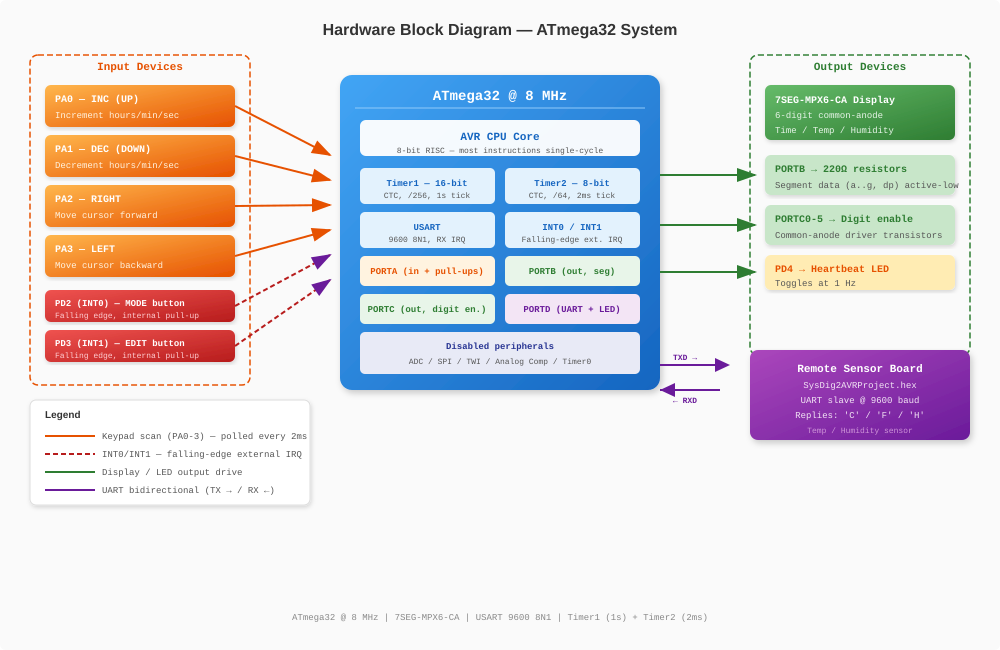

# Hardware

This document covers the physical build: pin assignment, bill of materials, the microcontroller's relevant peripherals, and the circuit schematic.

*(Content moved from the report's "System Architecture → Pin Mapping / Required Components", "System Architecture → Overall System Block Diagram", "Hardware Design → Microcontroller Description", and "Hardware Design → Circuit Schematic" sections.)*

## Microcontroller

The **ATmega32** is an 8-bit AVR RISC microcontroller executing most instructions in a single cycle, here operated at **8 MHz**. It provides:

- 32 KB in-system programmable flash, 2 KB SRAM, 1 KB EEPROM
- Four 8-bit I/O ports (A–D)
- Three timers (two 8-bit, one 16-bit)
- USART, SPI, TWI
- 10-bit ADC, analog comparator
- Four external interrupt sources

Peripherals used by this design: Timer1 (CTC, 1 Hz timekeeping), Timer2 (CTC, 2 ms multiplexing), USART (sensor link), INT0/INT1 (control buttons), and Ports A–D (keypad, segments, digit enables, UART/button/LED lines).

Unused peripherals — ADC, analog comparator, SPI, TWI, Timer0 — are explicitly disabled at start-up to reduce power draw and avoid spurious interrupts.

## Pin Mapping

| Port | Pin | Function | Connection |
|---|---|---|---|
| A | PA0 | Keypad UP | Keypad row 1 (internal pull-up) |
| A | PA1 | Keypad DOWN | Keypad row 2 (internal pull-up) |
| A | PA2 | Keypad RIGHT | Keypad row 3 (internal pull-up) |
| A | PA3 | Keypad LEFT | Keypad row 4 (internal pull-up) |
| B | PB0 | Segment a | 7-segment line a via 220 Ω |
| B | PB1 | Segment b | 7-segment line b via 220 Ω |
| B | PB2 | Segment c | 7-segment line c via 220 Ω |
| B | PB3 | Segment d | 7-segment line d via 220 Ω |
| B | PB4 | Segment e | 7-segment line e via 220 Ω |
| B | PB5 | Segment f | 7-segment line f via 220 Ω |
| B | PB6 | Segment g | 7-segment line g via 220 Ω |
| B | PB7 | Segment dp | Decimal point via 220 Ω |
| C | PC0 | Digit enable 1 | 7SEG-MPX6-CA common-anode DIG1 |
| C | PC1 | Digit enable 2 | 7SEG-MPX6-CA common-anode DIG2 |
| C | PC2 | Digit enable 3 | 7SEG-MPX6-CA common-anode DIG3 |
| C | PC3 | Digit enable 4 | 7SEG-MPX6-CA common-anode DIG4 |
| C | PC4 | Digit enable 5 | 7SEG-MPX6-CA common-anode DIG5 |
| C | PC5 | Digit enable 6 | 7SEG-MPX6-CA common-anode DIG6 |
| D | PD0 | TXD | UART transmit to sensor board |
| D | PD1 | RXD | UART receive from sensor board |
| D | PD2 | INT0 (falling edge) | Screen-cycle push-button |
| D | PD3 | INT1 (falling edge) | Edit-mode push-button |
| D | PD4 | Output | Heartbeat LED (1 Hz toggle) |
| D | PD5–PD7 | Unused | Left unconnected |

## Bill of Materials

| Component | Qty | Specification / Function |
|---|---|---|
| ATmega32 microcontroller | 1 | 8-bit AVR, 32 KB flash, 2 KB SRAM, 8 MHz |
| 7SEG-MPX6-CA display | 1 | 6-digit common-anode, multiplexed seven-segment |
| Sensor board | 1 | Separate AVR running `SysDig2AVRProject.hex` |
| Push-buttons (momentary) | 2 | Falling-edge, with internal pull-ups (INT0, INT1) |
| Keypad (4-key) | 1 | Active-low, internal pull-ups (UP/DOWN/LEFT/RIGHT) |
| LED (5 mm) | 1 | Heartbeat indicator, PD4 output |
| Resistor (220 Ω) | 8 | Current limiting for segment lines a–dp |
| Resistor (470 Ω) | 1 | Current limiting for heartbeat LED |
| Crystal (8 MHz) | 1 | System clock source |
| Ceramic capacitor (22 pF) | 2 | Crystal load capacitors |
| Capacitor (100 nF) | 2 | Decoupling capacitors for IC |
| Voltage regulator (7805) | 1 | 5 V regulation for board supply |
| Power supply (9–12 V DC) | 1 | Input to voltage regulator |
| Breadboard / PCB | 1 | Prototyping board |
| Connecting wires | As needed | Jumper wires for interconnections |

## Common-Anode Wiring Notes

- All segment anodes within one digit are tied to the digit's common-anode pin; segment cathodes are independent.
- A digit is **enabled** by driving its common-anode pin **HIGH**.
- A segment **illuminates** when its cathode is pulled **LOW** — i.e. segment data is active-low, which is reflected in the `seg_code[]` glyph table (e.g. digit `0` = `0xC0`).
- The keypad (PA0–PA3) uses internal pull-ups; a pressed key reads as logic 0.
- INT0/INT1 push-buttons (PD2/PD3) also use internal pull-ups with falling-edge detection.
- UART lines (TXD/RXD) cross-connect to the sensor board with a shared ground.
- PD4 drives the heartbeat LED through a series resistor.

## Block Diagram

ATmega32 controller board, 7SEG-MPX6-CA display, keypad, control push-buttons, heartbeat LED, and the remote sensor board connected over UART.

## Circuit Schematic

[Insert figure here — `sche.png`, the complete circuit schematic of the controller board.]

The segment lines are wired in parallel to Port B, each through a current-limiting resistor. The six common-anode lines are driven by Port C. Because the display is common-anode, digit-enable lines are active-high while segment data is active-low.
